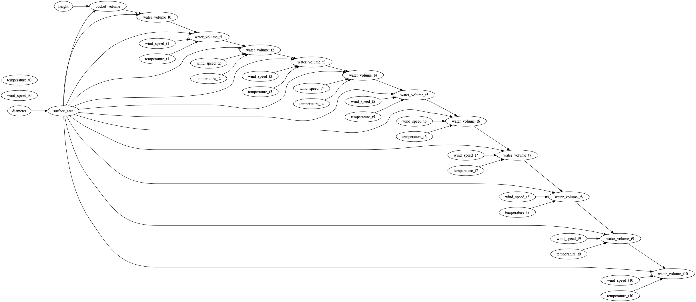

# A simple experiment to demonstrate confounding
We have built a simple computational model that simulates the daily evaporation of water from a bucket over a given
number of days. In this model, we have made the following assumptions:
1. The bucket is a perfect cylinder which is defined in terms of *height* and *diameter*.
2. Prior to execution, we can modify the height and diameter of the bucket only.
3. On each day, the temperature and wind speed are selected at random from the following list:
    - 3.1 Temperature (F): [40, 50, 60, 70, 80]
    - 3.2. Wind speed (ms^-1): [0, 0.5, 1, 1.5, 2]
4. The volume of water that evaporates daily (litres) is calculated as follows:

```python
4.54609 * ((7.4 * water_vapour_pressure_at_temp * surface_area *
            math.pow((0.447 * wind_speed), 0.78)) / (temperature + 459.67))
```

We can represent the expected causal relationships between the model's key variables over time
as the causal graph shown below:


Suppose we want to know what would happen to the volume of water in the bucket on day 10 if we filled the volume of 
the bucket on day 9 to 20L. That is, how much of the 20L would have evaporated in a single day?

Now suppose that we also want to know what would happen to the volume of water in the bucket on day 10 if we filled the
volume of the bucket on day 9 to 40L.

We refer to the outcomes (the volume of water on day 10) in these scenarios as *potential outcomes*. Whilst we could 
execute the model to calculate these values directly, for a more complex and resource-consuming model, this may not be 
feasible. In this case we would need to use previous execution data to estimate the potential outcomes. This is one of 
the main strengths of causal inference - to estimate counterfactual outcomes using observational data.

We have run the model with six different initial (massive) bucket configurations:
1. 2ft height, 1ft diameter
2. 2ft height, 10ft diameter
3. 3ft height, 2ft diameter
4. 5ft height, 2ft diameter
5. 10ft height, 2ft diameter
6. 10ft height, 10ft diameter

For each bucket configuration, we ran the model 100 times to account for the stochastic behaviour of temperature and
wind speed.

## How can we use this data to answer our causal question?
We want to answer the following causal question:
_What is the difference in the volume of water in the bucket on day 10 if I fill it to 20L on day 9 vs. if I fill it to
40L on day 9?_

Our causal graph tell us that the effect of day 9 volume on day 10 volume is confounded by the surface area of the 
bucket. Since surface area of a cylinder = `2*pi*d/`, it should be clear that we cannot directly compare the outcomes of 
all simulations. More precisely, we can compare buckets 2 and 6 and buckets 3, 4, and 5 since they have the same diameter
and therefore surface area, but we cannot compare bucket 1 to anything.

Consequently, if we do not adjust for the surface area (or diameter) of the bucket, we will obtain a biased estimate as 
we will include the outcome of bucket 1.

## Results
```
Adjusting for ['surface_area'] yields a causal estimate of 20.0L.
Without adjustment yields an estimate of 19.968L.
```

