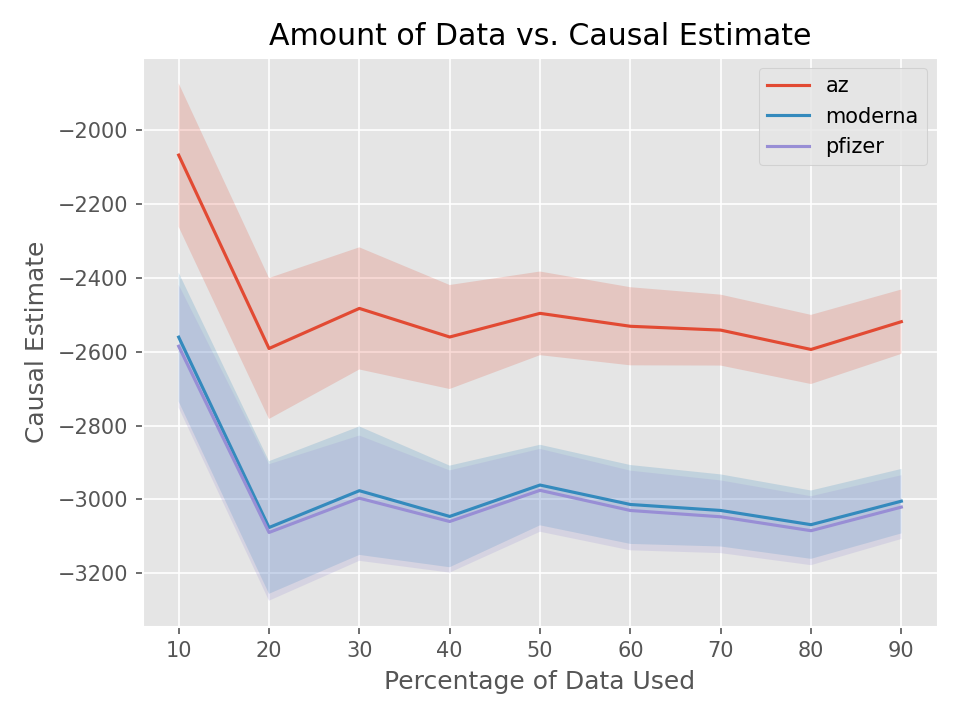

# RQ2: Can we use observational data to predict the outcome of a test case that has not been executed?

## Background
In the paper, we argue that a conventional software test (such as a unit test or acceptance test) is a form of 
**randomised experiment**. Central to the randomised experiment is the random assignment of treatment to individuals, 
which ensures that any observed association must be causation. The same is true of a software test. 

For a typical software test, we change *only* a single parameter and focus on the *effect* this has on some outcome, 
such as a function's output. As a consequence, we can be certain that the observed effect was *caused* by the changing 
the parameter (after accounting for non-determinism via repeats, if necessary). This works because in a software test we
have total control over the "world" in which we are experimenting (apart from non-determinism). Therefore, we know
exactly what was changed and thus what caused the observed outcome to change.

However, as is the case in conventional causal inference settings, a randomised experiment is not always feasible when
it comes to software. While conventional forms of software can be freely tested for the most part, more complex forms of
software, such as computational models, cannot be repeatedly executed due to long execution times. In other words, 
conventional testing approaches scale poorly with the complexity of computational models and, thus, are generally
too expensive to apply. Therefore, there is a need for a testing technique that can account for the long execution times
associated with computational models.

In causal inference, when it is not feasible to conduct a randomised experiment, researchers often turn to
*observational data*. That is, data which has been collected by observing the subjects of the study over time and 
without having an influence on them. Most importantly, treatment is not assigned to individuals at random in an
observational study and therefore association is **not** causation. However, using appropriate causal inference
techniques, we can identify sources of confounding bias in the observational data to discern association from causation
and draw causal conclusions without having to "run" an experiment.

In a software testing context, this means that, if we have access to previous execution data, we should be able to use
causal inference techniques to answer causal questions about the software. A causal question is simply a question of the
form "If I change T, does it cause Y to change?", where T is a treatment and Y is an outcome. Notice that the objective
of a test case is to answer a causal question, "If I change input I, does it cause Y to change to Y'?". Hence, using
causal inference, we have the potential to **predict the outcome of a test case without actually executing it**. 

In this experiment, we will investigate whether we can use simulated observational data to accurately predict the
outcome of a test case. We will focus on high-level acceptance tests centred around modelling scenarios in the Covasim
COVID-19 epidemiological agent-based model.

## Experimental Design
We have developed three different modelling scenarios in Covasim that we believe are realistic causal questions that an
epidemiologist may use Covasim to answer. All of the scenarios are based on the interventions functionality, which
enables users to simulate the effects of a variety of different interventions, such as vaccination and social 
distancing. Users may implement custom interventions or use preset ones. For this experiment, we are using preset
interventions to avoid introducing any bias ourselves. 

Our goal in this experiment is to evaluate whether observational data can be used to predict the outcome of a test case.
To achieve this, first we will design a series of test cases for each scenario and run these in the model, repeating 
each one 30 times to account for non-determinism. The outcome of these test cases will be the goal we wish to predict
using observational data.

Next, we need to simulate realistic observational data. To achieve this, we will generate and execute a number of 
quasi-random input configurations. To generate the input configurations, we will select a subset of important input
variables and sample values for these at random from appropriate distributions. Specifically, for numerical inputs,
we will sample values from a normal distribution centered around a sensible mean with a standard deviation that is 10%
of the mean. For categorical inputs, we will sample the categories from a uniform distribution.

We also want to understand how much observational data is needed to achieve an accurate estimate and whether there is a 
point of diminishing returns. To achieve this, we will repeatedly predict the outcome of each test case, incrementing
the amount of data used by 10% each time and observing the accuracy of the outcome in via 95% confidence intervals. 

For each experiment we will keep a number of parameters fixed. First, we will run each scenario for 5 weeks (35 days) 
and we will collect data on a weekly basis i.e. 5 data points for each time-varying variable. We will use the hybrid
population type, which is a compromise between model fidelity and execution time (there is one simpler population type
and one more complex).

## Scenario 1: Vaccination
In the first scenario, we will focus on the vaccination intervention. In Covasim, there are several different versions
of vaccine available by default. These are applied to the model on a daily basis on days that are specified by the user.
For simplicity, for model runs using a vaccine, we make the vaccine available from initialisation.

For the first test case, we want to compare the effect of three vaccines (pfizer, az, moderna) on the cumulative number
of infections after week five. To achieve this, we use the `compare_vaccines` feature that can be found under 
`causecumber/scenarios/compare_vaccines/features`. We would expect all three vaccines to reduce the cumulative number of
infections after week five. To this end, we have written the following scenario outline:
```cucumber
Scenario Outline: Single vaccine

    All vaccines should reduce the cumulative number of infections relative
    to the baseline scenario where no vaccine is available.

    Given no vaccine is available
    When the <vaccine_name> is available
    Then the cumulative number of infections should decrease
    Examples:
      | vaccine_name |
      | pfizer       |
      | moderna      |
      | az           |
```

As described above, we get the true outcome of the test case by running the model under a set of 
default conditions whilst changing *only* the vaccine parameter. We repeat this 30 times to account
for non-determinism. This gives us the following causal estimates and confidence intervals:

| Treatment   | Control | ATE (change in `cum_infections` after five weeks) | 95% Confidence Intervals |
|-------------|---------|---------------------------------------------------|--------------------------|
| Pfizer      | None    | -3114.5                                           | (-3356.9, -2872.2)       |
| Moderna     | None    | -3112.2                                           | (-3354.6, -2869.8)       |
| AstraZeneca | None    | -2565.6                                           | (-2812.8, -2318.4)       |


Therefore, our goal is to use observational data to get as close to these estimates as possible. Using the
methodology described above, we simulate the set of observational data found in 
`causecumber/experiments/observational_data/experiment_1_observational_data.csv`. For this observational data,
we used the following settings to generate 50 different input configurations:

| Input         | Fixed? | Distrubtion  | Parameters                           |
|---------------|--------|--------------|--------------------------------------|
| n_runs        | Y      | NA           | Value = 30                           |
| n_days        | Y      | NA           | Value = 35                           |
| pop_type      | Y      | NA           | Value = hybrid                       |
| use_waning    | Y      | NA           | Value = True                         |
| pop_size      | N      | Normal       | Mean = 50000, SD = 1000              |
| pop_infected  | N      | Normal       | Mean = 100, SD = 5                   |
| location      | N      | Uniform      | Values = [UK, China, France, Japan]  |
| interventions | N      | Uniform      | Values = [none, pfizer, moderna, az] |


We then re-run the same scenario but attach the `@observational.experiment_1_observational_data` tag above the scenario,
which tells CauseCumber to use the observational data stored in `experiment_1_observational_data.csv. This results in 50
different executions of the model, each of which is repeated 30 times to account for non-determinism, yielding a total 
of 1500 data points. Using all of this observational data, we get the following estimates:

| Treatment   | Control | ATE (change in `cum_infections` after five weeks) | 95% Confidence Intervals |
|-------------|---------|---------------------------------------------------|--------------------------|
| Pfizer      | None    | -3256.5                                           | (-3364.8, -3148.2)       |
| Moderna     | None    | -3256.3                                           | (-3517.8, -2994.9)       |
| AstraZeneca | None    | -2674.5                                           | (-2835.5, -2513.4)       |

Using this amount of data, we get very similar results. Additionally, since more data is used than in the original
experiments, we get narrower confidence intervals. This corresponds to greater confidence in the ATE. Therefore, for
this simple test case, we are able to predict the outcome of the test case without executing it pretty accurately. In 
all cases, the outcome of the test case is the same: a pass since the cumulative number of infections decreases. Also,
the order of the effectivess of the vaccines (in terms of reduction in cumulative infections) is preserved (Pfizer >
Moderna > AstraZeneca).

But our experiment uses a large amount of data which is not particularly realistic. To address this, we will re-run the
causal inference using different subsets of the data. We will start by selecting 10% of the data points at random and
then increment this by 10% until we reach 100%. The results of this experiment are shown in the figure below:

