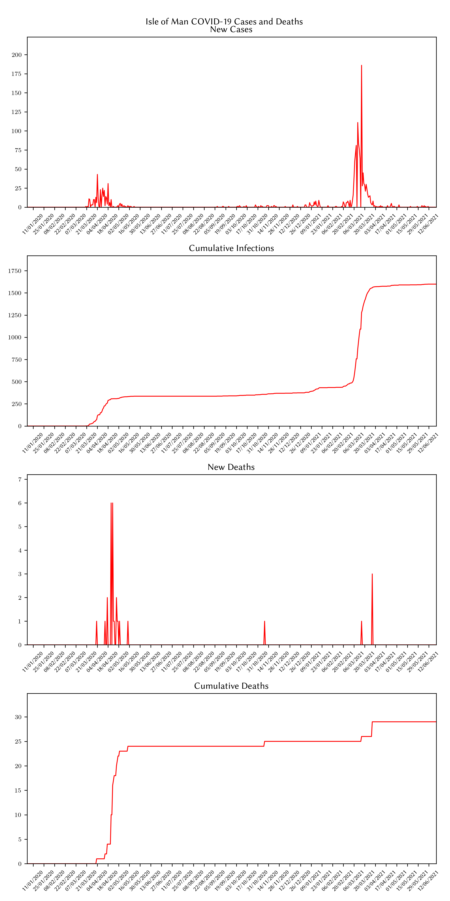
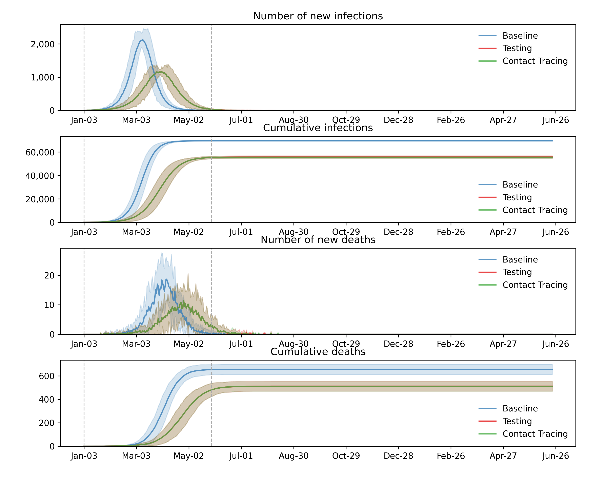
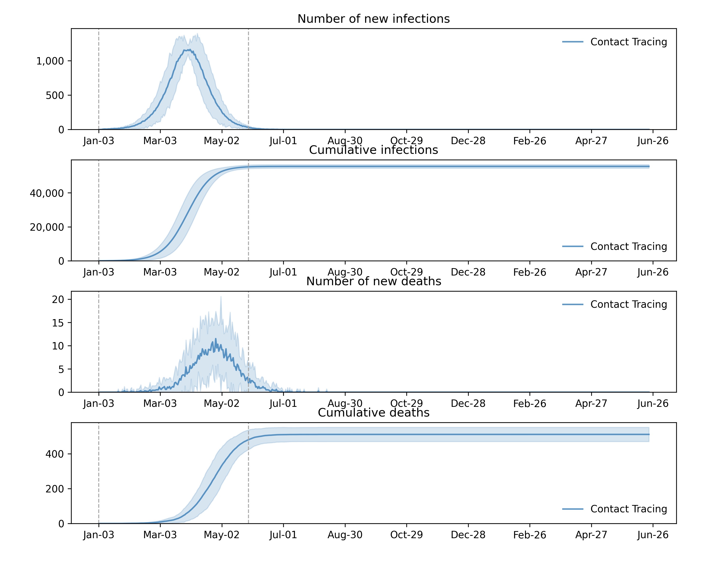

# Isle of Man Outbreak
Between February 2021 and April 2021, the Isle of Man experienced a sudden and severe outbreak of
COVID-19 cases. This can be seen in the figures below which represent the World Health Organisation's
COVID-19 data for the Isle of Man.

We will create a simulation of the COVID-19 pandemic between the 3rd January 2020 and 22nd June 2021 and
see whether the predicted outcomes match the true data. To achieve this, we will create a Covasim MultiSim and run this
10 times with the following parameters:
- Location: UK (No Isle of Man, UK is closest)
- Start day: 2020-01-03 (Year-Month-Day)
- End day: 2021-06-22 (Year-Month-Day)
- Population type: Hybrid (Allows modelling of agent contacts in different environments including schools and workplace)
- Population size: 84584 (Isle of Man population from 2019)

In order to achieve the most realistic simulation, we have also implemented two interventions: testing and contact
tracing. We assume that testing is available from the beginning of the pandemic (although this is an optimistic
assumption) and we implement contact tracing (which requires testing) from May 28th 2020. We could further improve this
simulation by implementing different versions of testing as these became available. For example, PCR testing and RF
testing.

The figures below show the results of this MultiSim:

If we focus on just contact tracing, we obtain the following figure:

